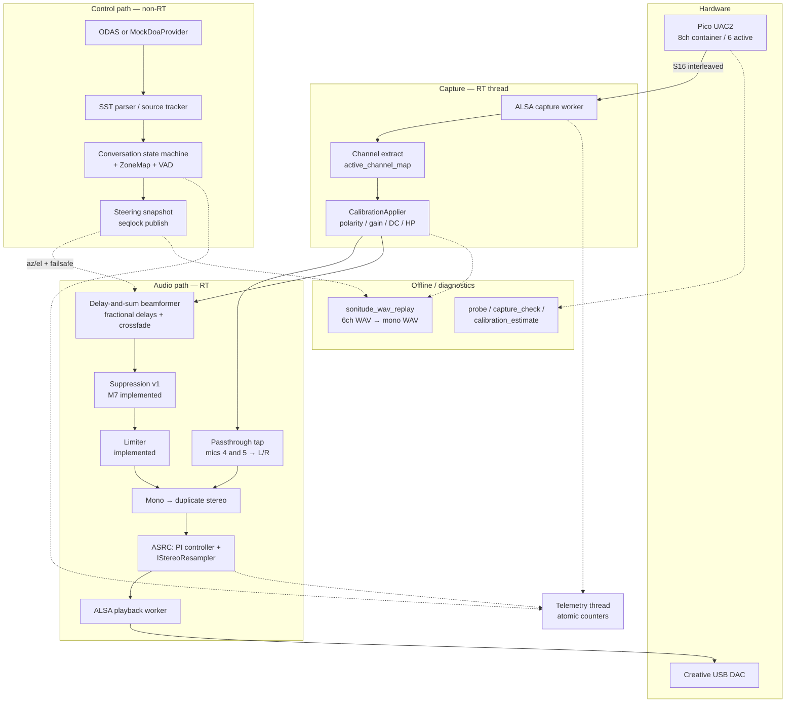

# Sonitude Real-Time Audio

Sonitude is a staged Raspberry Pi 5 real-time audio engineering proof-of-concept for a six-microphone head-worn array. The v1 objective is deterministic directional listening with ODAS-driven control and a custom low-latency time-domain beamforming audio path.

## Pipeline

Sonitude splits into a **real-time audio path** (PCM) and a **control path** (steering only). ODAS is **control-only** in v1 — it does not process audio. Dashed edges are non-RT or planned stages.




| Stage                | What it does                                                                                |
| -------------------- | ------------------------------------------------------------------------------------------- |
| **Extract**          | Pull 6 active channels from 8-channel USB container (`MicFrame` = 6 floats)                 |
| **Calibration**      | Per mic: polarity, DC subtract, gain, high-pass (`CalibrationApplier`)                      |
| **Beamformer**       | Align mics in time for steering angle; sum with 1/6 weights → mono (M4)                     |
| **ASRC**             | PI controller adjusts playback resample ratio so capture/playback clock drift does not XRUN |
| **Passthrough mode** | Today: ear-cup mics 4/5 to L/R, bypasses beamformer (`--mode passthrough`)                  |
| **Control**          | ODAS/mock → tracker → state machine → atomic snapshot; audio thread reads snapshot only     |


**Clock rule:** Pico and DAC clocks are independent (~tens of ppm). Never drop/duplicate samples for drift — use bounded ASRC ratio control (default ±0.5%).

Full stage-by-stage detail, implementation status, and scope vetoes: `[docs/CodebaseState.md](docs/CodebaseState.md)` (§1 scope, §2 DSP).

### Stage 1 — Capture and channel extract (feeds DSP)

`CaptureWorker` reads one ALSA period from the 8-channel USB container; `ExtractActiveMicFrames` pulls the six active mics via `active_channel_map`.

Each instant is a `MicFrame` (`std::array<float, 6>`). At 44.1 kHz with 64-frame periods, each read yields a block of 64 `MicFrame`s.

### Stage 2 — Calibration (`CalibrationApplier`)

**File:** `src/dsp/calibration_applier.cpp`

Per mic, per sample:

1. **Polarity** — multiply by +1 or −1
2. **DC subtract** — remove measured offset
3. **Gain** — multiply by `gain_linear`
4. **DC blocker** — one-pole high-pass with `calibration_dc_block_hz` (default 20 Hz)

`delay_samples` from calibration YAML is **not** applied in `CalibrationApplier` today. The beamformer (M4) applies per-channel delay (calibration + steering) in one fractional delay line per channel.

### Stage 3 — Beamformer (M4; implemented, validation in progress)

Core **directional listening** DSP — **delay-and-sum**:

1. From mic geometry (metres) and speed of sound, compute **far-field delays** for steering direction **u** (azimuth + elevation).
2. Delay each channel so all mics **align in phase** for sources from **u**.
3. **Sum** with equal weights **1/6** → one **mono** sample.

On-target speech adds coherently; off-axis energy is partially rejected (exact contrast depends on array aperture and frequency).

- **Fractional delays:** 8-tap windowed-sinc FIR per channel; base delay keeps all effective delays positive across steering range.
- **Click-free steering:** dual-beam **crossfade** over `steering_ramp_ms` (default 150 ms) when target changes — old and new delay sets rendered in parallel and blended.
- **Control handoff:** non-RT thread publishes a **steering snapshot**; audio thread reads it only (no sockets/JSON on RT path).


### Stage 4 — Suppression (M7; implemented, validation in progress)

Conservative **distractor suppression** after beamforming, with explicit user selection and an **ambient floor**. v1 avoids MVDR/nulling and neural processing (**SCOPE-3**).

### Stage 5 — Mono → stereo

- `--mode passthrough` **(today):** taps ear-cup mics 4 and 5 to L/R in `main.cpp` — no beamformer.
- `--mode beamform` **(implemented):** duplicate mono beam to both channels (no HRTF in v1).


### Stage 6 — ASRC: resampler + PI controller (implemented)

Capture and playback clocks drift even at the same nominal rate. Sonitude adjusts **playback speed** within bounds (default ±0.5%) instead of dropping/duplicating samples.

**PI controller** (`AsrcController`, `src/dsp/asrc_controller.hpp`):

- Input: playback **buffer occupancy** (frames queued)
- Error: `target_buffer_frames - occupancy`
- Output: resample **ratio** clamped to `[min_ratio, max_ratio]` with slew-limited steps
- Too full → ratio < 1 (generate fewer playback frames); too empty → ratio > 1 (generate more)
- Default target: 128 frames; startup requires one negotiated block of headroom above the retained software-queue floor and below playback-capacity ceiling
- Negotiated capture/playback rates must exactly match their configured nominal DSP rates
- Startup also verifies negotiated capture channels can satisfy `active_channel_map`
- Telemetry: `asrc_ratio_ppm`, `pb_write_fail`

**Stereo resampler** (`IStereoResampler`, `PlaybackWorker`):


| Backend                            | When                                               | Method                                            |
| ---------------------------------- | -------------------------------------------------- | ------------------------------------------------- |
| libsamplerate (`SRC_SINC_FASTEST`) | Build with `SONITUDE_WITH_LIBSAMPLERATE_ENABLED=1` | Variable-ratio sinc                               |
| Linear (fallback)                  | Default portable build                             | Linear interp; phase += `1/ratio` per output sample |


## Milestones

Authoritative gate evidence: `[docs/milestones.md](docs/milestones.md)`.


| ID     | Milestone                        | Status        | Gate (summary)                                                                      |
| ------ | -------------------------------- | ------------- | ----------------------------------------------------------------------------------- |
| **M0** | Scaffold                         | `done`        | CMake configure/build; `--validate-config`; CTest passes                            |
| **M1** | ALSA discovery and raw loopback  | `in_progress` | Device probe with negotiated params; raw capture-to-output; channel order validated |
| **M2** | Real-time primitives             | `in_progress` | Lock-free/preallocated path; XRUN telemetry; ASRC interface; passthrough mode       |
| **M3** | Calibration and offline analysis | `in_progress` | Calibration apply path; offline estimator; YAML report with backup-safe writes      |
| **M4** | Beamformer                       | `in_progress` | Fractional delay-and-sum implemented; scripted steering WAV harness passes synthetic checks |
| **M5** | ODAS control integration         | `pending`     | Mock provider + ODAS adapter; safe fallback on ODAS loss                            |
| **M6** | Conversation state machine       | `pending`     | Deterministic hysteresis transitions; telemetry for state and confidence            |
| **M7** | Suppression v1                   | `in_progress` | One-distractor conservative policy implemented; smooth fade in/out; safe fallback checks pending |
| **M8** | Measurement and hardening        | `pending`     | Latency marker tooling; soak logs; measured latency percentiles reported            |


Status legend: `pending` · `in_progress` · `done` · `blocked`

```bash
./build/sonitude_realtime --config config/default.yaml --mode passthrough   # development
./scripts/run_realtime.sh                                                   # production Pi
ctest --test-dir build --output-on-failure                                 # portable
```

The production launcher explicitly uses `config/production_pi.yaml`. It fails
startup unless `mlockall(MCL_CURRENT | MCL_FUTURE)` succeeds and both audio
threads obtain their requested FIFO policies. Before accepting a Pi run, the
printed scheduling table must show capture `SCHED_FIFO/80`, playback
`SCHED_FIFO/78`, and control/telemetry `SCHED_OTHER/0`, with no `DEGRADED`
thread.


## Scope guardrails

Default v1 baseline rules. Unchecked = guardrail active; checked in `[docs/CodebaseState.md](docs/CodebaseState.md)` = user override (Cursor may implement that scope change).


| ID          | Rule                                                                                        | Rationale                                                           |
| ----------- | ------------------------------------------------------------------------------------------- | ------------------------------------------------------------------- |
| **SCOPE-1** | No desktop audio servers in the critical path (PipeWire, PulseAudio, JACK)                  | Adds buffering and latency variance; breaks direct-ALSA RT contract |
| **SCOPE-2** | No ODAS audio processing in the critical path — ODAS is control-only                        | PCM beamforming stays in Sonitude; ODAS loss must not stop audio    |
| **SCOPE-3** | No MVDR / LCMV / GSS / neural DSP in v1 baseline milestones                                 | v1 is delay-and-sum plus one conservative suppressor                |
| **SCOPE-4** | No unmeasured end-to-end latency claims                                                     | Only M8 impulse/loopback measurement may support latency statements |
| **SCOPE-5** | No distance-estimation or strong automatic nulling claims; at most one suppressor in v1     | Avoids unsupported product statements and M7+ scope creep           |
| **SCOPE-6** | No milestone marked complete without its observable gate (evidence in `docs/milestones.md`) | Staged delivery integrity                                           |
| **SCOPE-7** | Pico firmware snapshot may be vendored for reference only; no host build coupling or host-side firmware edits | Keeps host app repo focused while preserving reproducible hardware contracts |


Veto checkboxes and override log: `docs/CodebaseState.md` [§1](docs/CodebaseState.md#1-global-project-scope).

## Current status

See the [Milestones](#milestones) table above. Quick summary:

- **Implemented:** scaffold, typed config, ALSA probe/workers, RT primitives (SPSC, block pool), ASRC + resampler, calibration load/apply/WAV tools, passthrough mode, unit tests.
- **In progress / pending gates:** Pi hardware soak (M1–M3), M4/M7 hardware evidence, M5 ODAS control gate, M6 state machine gate, M8 latency measurement.


## Repository layout

```text
.
├── CMakeLists.txt
├── CMakePresets.json
├── cmake/
├── config/
├── docs/
├── scripts/
├── src/
└── tests/
```


## Dependencies


### Linux (Raspberry Pi target host)

- `cmake` (>= 3.20)
- `ninja-build`
- C++20 compiler (`g++`or`clang++`)
- `yaml-cpp`
- `spdlog`

Example install (Debian/Raspberry Pi OS):

```bash
sudo apt update
sudo apt install -y cmake ninja-build g++ libasound2-dev libyaml-cpp-dev libspdlog-dev libsamplerate0-dev
```


### Windows development scaffold validation

Milestone 0 can be configured and tested on Windows if CMake and a C++ toolchain are available. If `yaml-cpp`/`spdlog` are not installed, CMake fetches them automatically when `SONITUDE_FETCH_DEPS=ON`.

## Build

From repository root:

```bash
cmake -S . -B build -G Ninja -DCMAKE_BUILD_TYPE=Debug
cmake --build build
```

Or using presets:

```bash
cmake --preset default-debug
cmake --build --preset build-debug
```


## Run

Validate config only:

```bash
./build/sonitude_realtime --config config/default.yaml --validate-config
```

Linux passthrough (6-mic capture → ear-cup stereo → ASRC → playback):

```bash
./build/sonitude_realtime --config config/default.yaml --mode passthrough
```

Passthrough requires ALSA and configured capture/playback devices. On Windows, build and run unit tests only.

## Tests

```bash
ctest --test-dir build --output-on-failure
```


## Device and milestone documentation

- **Codebase snapshot (scope, DSP, layout, interfaces):** `[docs/CodebaseState.md](docs/CodebaseState.md)`
- Architecture and thread/data ownership: `[docs/architecture.md](docs/architecture.md)`
- Linux/ALSA setup and runtime policy: `[docs/device_setup.md](docs/device_setup.md)`
- Calibration format and tooling roadmap: `[docs/calibration.md](docs/calibration.md)`
- Latency measurement method and caveats: `[docs/latency_measurement.md](docs/latency_measurement.md)`
- Full milestone gate checklist and evidence tracking: `[docs/milestones.md](docs/milestones.md)`

