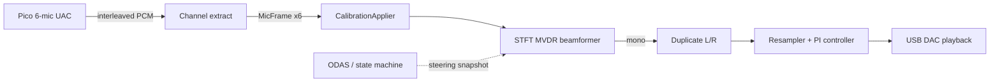

# CodebaseState

Unified tracker for Sonitude core: **global scope, guardrails, user veto checkboxes**, **DSP signal path**, directory layout, milestone reality, key interfaces, config schema, tests, conventions, ODAS posture, and CMake wiring. Treat this document as the living snapshot; `docs/milestones.md` **remains authoritative for milestone gates**. Unchecked scope vetoes are binding on Cursor; checked vetoes explicitly authorize otherwise-prohibited work.

Last updated: 2026-08-30.

### Implementation status snapshot (M4–M7)

```text
capture -> calibration -> STFT MVDR target (+ internal guard spectra)
  -> optional same-hop spectral NS, else conservative PCM / off
  -> limiter -> binaural/ASRC -> playback
```

| Stage | Milestone | Current status | Notes |
| --- | --- | --- | --- |
| Stage 2 | M3 calibration | in_progress | `CalibrationApplier` live; GCC-PHAT offline estimator + v2 schema; HW sweep evidence pending |
| Stage 3 | M4 beamformer | in_progress | STFT-domain MVDR (128/32), delay-and-sum fallback, steering crossfade. SCOPE-3 vetoed for MVDR. |
| Stage 4 | M7 suppression/limiter | in_progress | Conservative default. Spectral NS shares the MVDR 128/32 hop (guard spectra stay in the frequency domain). Experimental; not the shipping voice suppressor. |

| Block | Status |
| --- | --- |
| STFT-domain MVDR beamformer | Implemented (experimental; delay-and-sum fallback) |
| Suppression v1 (conservative, floor-clamped) | Implemented |
| Limiter v1 (peak limiter) | Implemented |
| ODAS control adapter + mock provider | Implemented |
| Conversation state machine | Implemented |
| M8 latency instrumentation evidence | Pending hardware run |

**Validation artifacts:** unit tests in `tests/unit/`; offline render via `sonitude_wav_replay`; openMHA comparison via `scripts/openmha_golden_render.sh` and `tests/integration/openmha_m4_validation.md`.

---

## 1. Global project scope

Sonitude is a **staged Raspberry Pi 5 real-time audio proof-of-concept** for a six-microphone head-worn array. The v1 objective is **deterministic directional listening**: an in-tree **STFT-domain MVDR beamformer** on the audio path (delay-and-sum fallback), with **ODAS-driven (or mock) control** for steering, zones, and conversation state. Work lives in this repository only; sibling projects (Pico firmware, Sound Bubble neural code, HRTF tooling, source-localization experiments) stay in their own repos — reuse documented contracts and algorithmic ideas, do not vendor or modify them.

### Target runtime path

```text
Pico UAC capture (6 active / 8 container)  --direct ALSA-->
  calibration -> beamformer -> (optional suppression) -> limiter -> mono-to-stereo
  -> ASRC drift control -> Creative USB DAC playback
```

```text
ODAS (or mock) DOA  --non-blocking IPC-->  control thread
  -> source tracking -> conversation state machine -> atomic steering snapshot
  -> audio thread reads snapshot only (no blocking, no sockets on RT path)
```

- **Capture and playback:** direct ALSA on Raspberry Pi OS 64-bit (`hw:` devices). Windows is a portable build/test host for unit tests and offline tools; ALSA runtime is Linux-gated.
- **Clocks:** capture and playback are independent; sustained output requires bounded ASRC ratio control, not sample drop/duplicate.
- **Control vs audio:** ODAS and the state machine run on non-RT threads; the audio thread consumes only wait-free steering snapshots.


### In scope (M0–M8 baseline milestones)


| Area  | v1 intent                                                                            |
| ----- | ------------------------------------------------------------------------------------ |
| M0–M1 | Scaffold, typed config, direct ALSA probe and raw I/O                                |
| M2    | RT primitives (SPSC, block pool), ASRC, passthrough                                  |
| M3    | Per-channel calibration (polarity, gain, delay, DC), offline estimation              |
| M4    | `MvdrBeamformer` (STFT-domain MVDR with delay-and-sum fallback), steering ramp, offline WAV renderer |
| M5    | Mock-first ODAS control, source association, failsafe steering publication           |
| M6    | Conversation state machine, wrap-safe zones, scripted VAD                            |
| M7    | One conservative suppression policy, explicit user selection, ambient floor          |
| M8    | Measured latency markers, soak/hardening runbook — **claims only after measurement** |


Milestone gates and evidence fields: `docs/milestones.md` (authoritative).

### Scope guardrails (hard prohibitions)

Default v1 baseline rules. **Unchecked veto = guardrail active** — Cursor must not implement the prohibited item. **Checked veto = user override** — Cursor may proceed with that scope change (e.g. route audio through ODAS, add PipeWire, ship MVDR).

#### Scope veto protocol (for Cursor and reviewers)

1. **Do not self-veto.** Only the user checks a veto box. Agents must not mark `[x]` unless the user explicitly asked to veto that ID in the current task or a prior committed edit to this file.
2. **One ID at a time.** Vetoing SCOPE-2 (ODAS audio) does not imply SCOPE-1 or SCOPE-3 are waived.
3. **Record the override.** When the user checks a veto, add a row to the [Veto log](#scope-veto-log) (date, ID, brief reason). Implementation work should reference the veto ID in commit/PR text.
4. **Revert by unchecking.** Unchecking restores the guardrail; new code that depended on the veto should be removed or gated behind explicit config, not left as silent default behavior.


| Veto  | ID          | Rule                                                                                                                                           | Rationale                                                                                             |
| ----- | ----------- | ---------------------------------------------------------------------------------------------------------------------------------------------- | ----------------------------------------------------------------------------------------------------- |
| - [ ] | **SCOPE-1** | **No desktop audio servers in the critical path** (PipeWire, PulseAudio, JACK).                                                                | Adds buffering, routing, and latency variance; breaks the direct-ALSA RT contract.                    |
| - [ ] | **SCOPE-2** | **No ODAS audio processing in the critical path** — ODAS is **control-only** (DOA/tracking → steering). All PCM beamforming stays in Sonitude. | Keeps audio latency and ownership on the RT path; ODAS loss must not stop audio.                      |
| - [x] | **SCOPE-3** | **No MVDR / LCMV / GSS / neural DSP** in v1 baseline milestones.                                                                               | Vetoed 2026-08-30 for in-tree MVDR. Neural / GSS remain unused. |
| - [ ] | **SCOPE-4** | **No unmeasured end-to-end latency claims.** Period arithmetic and config defaults are not product latency.                                    | Only M8 impulse/loopback measurement may support latency statements.                                  |
| - [ ] | **SCOPE-5** | **No distance-estimation or strong automatic nulling claims.** At most one selected suppressor in v1.                                          | Avoids unsupported product statements and scope creep into M7+ behavior without gates.                |
| - [ ] | **SCOPE-6** | **No milestone marked complete without its observable gate** (evidence in `docs/milestones.md`).                                               | Staged delivery integrity; no “implemented” without tests/evidence.                                   |
| - [x] | **SCOPE-7** | **Pico firmware is reference-only unless the user explicitly authorizes an isolated firmware experiment**; host build coupling remains out of scope. | Keeps host delivery focused while allowing evidence-gated, default-off embedded prototypes. |


#### Scope veto log

Fill when the user checks a veto above (newest first).


| Date | ID  | Reason (user-approved override) |
| ---- | --- | ------------------------------- |
| 2026-08-30 | SCOPE-7 | User requested a default-off RP2350/CMSIS-DSP MVDR and OVD scaffold. Host PR #34 no longer carries that example; the snapshot remains on `feature/rp2350-experimental-mvdr` at the pre-extraction commit. |
| 2026-08-30 | SCOPE-3 | Replace delay-and-sum with in-tree STFT-domain MVDR; neural DSP still not in this PR. |
| 2026-08-12 | SCOPE-7 | Keep vendored Pico firmware snapshot as read-only reference; no host CMake coupling or host-side firmware edits. |


**Examples (do not check unless the user requests):**

- Veto **SCOPE-2** → allow ODAS to process audio (beamform/null in ODAS; Sonitude becomes capture/playback shell).
- Veto **SCOPE-1** → allow PipeWire/PulseAudio/JACK in the capture or playback path.
- Veto **SCOPE-3** → allow MVDR/GSS/neural beamformer in the RT path.


### Repository boundary


| In this repo (`Sonitude/`)                         | Out of tree (sibling repos)                    |
| -------------------------------------------------- | ---------------------------------------------- |
| Pi host app: ALSA, DSP, RT, control, tests, config | Sound Bubble, HRTF tooling, SSL experiments    |
| ODAS adapter, mock provider, config generator      |                                                |
| Offline WAV replay / calibration tools             |                                                |
| Reference-only firmware snapshot: `mic-array-pico2w-usb6ch/` |                                          |


---


## 2. How the DSP works

Sonitude splits processing into a **real-time audio path** (PCM in → processed mono/stereo out) and a **control path** (DOA/state → steering angles). In v1, ODAS does **not** process audio; it only tells the beamformer where to point (unless **SCOPE-2** is vetoed).

### Big picture




- **Sample format:** internal DSP uses **float** (`MicFrame` = six floats per time step). ALSA I/O converts to/from negotiated device PCM (S16/S24_3LE/S32/FLOAT32 are mapped).
- **Clocks:** Pico capture and DAC playback are **independent** (~tens of ppm apart). Sustained output requires **ASRC** ratio control; never drop/duplicate samples for drift correction.


### Stage 1 — Capture and channel extract (feeds DSP)

`CaptureWorker` reads one ALSA period from the 8-channel USB container; `ExtractActiveMicFrames` pulls the six active mics via `active_channel_map`. Startup now rejects configs where negotiated capture channels cannot satisfy that map.

Each instant is a `MicFrame` (`std::array<float, 6>`). At 44.1 kHz with 64-frame periods, each read yields a block of 64 `MicFrame`s.

`AlsaPcmDevice` stores `negotiated_` from the applied ALSA hardware state (`snd_pcm_hw_params_get_*`) instead of assuming the requested values were accepted unchanged.

### Stage 2 — Calibration (`CalibrationApplier`)

**File:** `src/dsp/calibration_applier.cpp`

Per mic, per sample:

1. **Polarity** — multiply by +1 or −1
2. **DC subtract** — remove measured offset
3. **Gain** — multiply by `gain_linear`
4. **DC blocker** — one-pole high-pass with `calibration_dc_block_hz` (default 20 Hz)

`delay_samples` from calibration YAML is **not** applied in `CalibrationApplier` today. The beamformer (M4) applies per-channel delay (calibration + steering) as the MVDR steering-vector phase.

### Stage 3 — Beamformer (M4; implemented)

Core **directional listening** DSP — **narrowband MVDR** (`MvdrBeamformer`):

1. From mic geometry and speed of sound, form the far-field steering vector **d** (plus calibration delay) for look **u**.
2. 128/32 STFT of all six channels; per bin solve distortionless MVDR (delay-and-sum fallback on DC/Nyquist, failed solve, or excess white-noise gain).
3. Inverse STFT → audible **mono**. Three extra looks (+90°, −90°, 180°) are formed the same way for spectral contrast only.

- **Algorithmic delay:** 127 samples (128/32 first-arrival). Spectral NS shares this hop.
- **Click-free steering:** dual-look **crossfade** over `steering_ramp_ms`; covariance frozen during the fade.
- **Control handoff:** non-RT thread publishes a **steering snapshot**; audio thread reads it only.


### Stage 4 — Suppression and limiter (M7; implemented)

Conservative **distractor suppression** after beamforming, with explicit user selection and an **ambient floor**, followed by a peak limiter. In-tree **MVDR** is in the beamformer (**SCOPE-3** vetoed). Neural DSP is still unused.

### Stage 5 — Mono → stereo

- `--mode passthrough` **(today):** taps ear-cup mics 4 and 5 to L/R in `main.cpp` — no beamformer.
- `--mode beamform` on `sonitude_realtime`: still duplicates directional mono to L/R. The Pi playback path is **not** yet wired to `BinauralRenderer`.
- Portable tools: `BinauralRenderer` (`mono_reference`, `itd_ild`, `compact_hrtf`, `full_hrtf_reference`) then linked `StereoPeakLimiter`. See `docs/binaural_renderer.md`.


### Stage 6 — ASRC: resampler + PI controller (implemented)

Capture and playback clocks drift even at the same nominal rate. Sonitude adjusts **playback speed** within bounds (default ±0.5%) instead of dropping/duplicating samples.

**PI controller** (`AsrcController`, `src/dsp/asrc_controller.hpp`):

- Input: playback **buffer occupancy** (frames queued)
- Error: `target_buffer_frames - occupancy`
- Output: resample **ratio** clamped to `[min_ratio, max_ratio]` with slew-limited steps
- Too full → ratio < 1 (generate fewer playback frames); too empty → ratio > 1 (generate more)
- Startup validates the target against the occupancy range `[software_queue_frames, software_queue_frames + playback_buffer_frames]` and requires one block of headroom on both sides.
- Telemetry: `asrc_ratio_ppm`, `playback_write_failures`

**Stereo resampler** (`IStereoResampler`, `PlaybackWorker`):


| Backend                            | When                                               | Method                                            |
| ---------------------------------- | -------------------------------------------------- | ------------------------------------------------- |
| libsamplerate (`SRC_SINC_FASTEST`) | Build with `SONITUDE_WITH_LIBSAMPLERATE_ENABLED=1` | Variable-ratio sinc                               |
| Linear (fallback)                  | Default portable build                             | Linear interp; phase += `1/ratio` per output sample |


### Implemented vs planned (DSP blocks)


| Block                        | Status                                       |
| ---------------------------- | -------------------------------------------- |
| PCM format convert           | Implemented (`src/audio/format_convert.hpp`) |
| 6-ch extract                 | Implemented                                  |
| Calibration (pol/gain/DC/HP) | Implemented                                  |
| Calibration delay            | Implemented (MVDR steering-vector phase)     |
| STFT-domain MVDR beamformer  | Implemented (M4; delay-and-sum fallback)     |
| Binaural renderer / HRTF tables | Implemented (portable tools; not yet in `sonitude_realtime`) |
| Stereo limiter (linked)      | Implemented (`StereoPeakLimiter`)            |
| Suppression / limiter        | Implemented (M7)                             |
| ASRC PI + resampler          | Implemented                                  |
| ODAS audio processing        | Out of scope (**SCOPE-2**); control-only     |


### Offline vs real-time

- **Real-time:** capture → calibration → beamformer → … → ASRC → ALSA playback on Pi.
- **Offline:** `sonitude_wav_replay` (M4) renders beamformed mono from a 6-ch file + steering script, with optional `--output-binaural` stereo. `sonitude_stream_process` is a portable protocol-v2 stdin/stdout adapter for the same DSP chain. The PySide6 test bench in `testbench/` drives both: short files use wav_replay (taps + optional sweep); files ≥ 30 s or > 24 MiB PCM stream through `stream_process` without loading the capture into RAM, then honour WAV/FLAC `processed_export`; the Recorded tab can also preview a file with live steering/binaural. Identical live `setDirection`/`setTarget` calls do not restart the 150 ms crossfade. Compact HRTF tables are experimental HRIR prefixes, not an edge-selected representation. This GUI is **not** on the RT path. **PR #33** (`feature/binaural-renderer-dsp`) is superseded by PR #32 for code; do not merge it.
- **Tests:** `asrc_sim_tests.cpp` simulates ppm mismatch without wall clock to verify PI stability.

**One-line summary:** align six mics toward the talker (beamformer), clean per-mic errors (calibration), play at a slightly variable rate (ASRC) so independent USB clocks do not XRUN, while a separate control loop sets steering without touching PCM.

---


## 3. Directory tree (Sonitude core)

Excluding `.git`, `build/`, and the vendored `mic-array-pico2w-usb6ch/` Pico firmware tree.

```text
Sonitude/
├── CMakeLists.txt              # Root build: targets, options, CTest
├── CMakePresets.json           # default-debug / default-release presets
├── .clang-format
├── .gitignore / .gitattributes
├── README.md                   # Overview, DSP summary, build/run; links here for detail
├── cmake/
│   └── Dependencies.cmake      # ALSA find; FetchContent yaml-cpp/spdlog
├── config/
│   ├── default.yaml            # Runtime: devices, ASRC, steering, zones, SM, ODAS, telemetry, binaural
│   ├── geometry_soundbubble_initial.yaml  # 6-mic XYZ positions
│   └── calibration_example.yaml           # Per-mic polarity/gain/delay/DC
├── data/
│   └── hrtf/generic_sadie2_d2/ # SADIE II D2 compact/reference `.shrf` tables + LICENSE
├── docs/
│   ├── milestones.md           # M0–M8 status + gates
│   ├── architecture.md         # Target pipeline / thread model
│   ├── binaural_renderer.md    # Implemented binaural DSP + protocol v2 tools
│   ├── binaural_renderer_dsp_proposal.md  # Design spec
│   ├── calibration.md          # Calibration schema + planned order
│   ├── device_setup.md         # ALSA/RT runbook (planned)
│   ├── latency_measurement.md  # M8 measurement method
│   ├── pr32_testbench_software_proposal.md
│   ├── binaural_renderer_dsp_proposal.md
│   └── CodebaseState.md        # This document
├── scripts/
│   ├── run_realtime.sh
│   ├── set_realtime_environment.sh
│   └── verify_alsa_devices.sh
├── src/
│   ├── main.cpp                # sonitude_realtime: validate / passthrough
│   ├── app/                    # Config, calibration I/O, logging
│   ├── audio/                  # Types, PCM, WAV, ALSA workers
│   ├── dsp/                    # Calibration, beamformer, suppressor, binaural, limiter, resampler, ASRC
│   ├── rt/                     # SPSC ring, block pool, RT thread, telemetry
│   ├── spatial/                # ODAS parser, tracker, head-frame helpers
│   ├── vad/                    # IVad interface stub only
│   └── tools/                  # Probe/check/calibration/latency/replay/stream_process CLIs
├── testbench/                  # PySide6 algorithm test bench (non-RT)
└── tests/
    ├── unit/                   # Single binary unit suite
    ├── fixtures/               # YAML fixtures for config tests
    └── integration/README.md   # Planned: beamformer / ODAS / SM harnesses
```


### `src/` file purposes


| Path                                                                       | Purpose                                                                        |
| -------------------------------------------------------------------------- | ------------------------------------------------------------------------------ |
| `src/main.cpp`                                                             | CLI: `--validate-config`, `--mode passthrough` (Linux ALSA loop earcup→stereo) |
| `src/app/config.hpp/.cpp`                                                  | Typed YAML load + validation for runtime/geometry                              |
| `src/app/calibration_config.hpp/.cpp`                                      | Calibration YAML load/validate                                                 |
| `src/app/calibration_writer.hpp/.cpp`                                      | Backup-safe calibration YAML write                                             |
| `src/app/logging.hpp/.cpp`                                                 | Startup spdlog init                                                            |
| `src/audio/audio_types.hpp`                                                | `MicFrame`, steering, stereo, sequence info                                    |
| `src/audio/format_convert.hpp`                                             | PCM encode/decode helpers                                                      |
| `src/audio/channel_extractor.hpp`                                          | Container→6-mic extract                                                        |
| `src/audio/wav_io.hpp/.cpp`                                                | Multichannel WAV read/write                                                    |
| `src/audio/alsa/*`                                                         | Probe, device open, capture/playback workers                                   |
| `src/dsp/calibration_applier.*`                                            | Polarity/gain/DC + HP (delay applied in beamformer stage)                      |
| `src/dsp/binaural_renderer.*`                                              | Portable mono→stereo renderer (ITD/ILD + HRTF FIR)                             |
| `src/dsp/hrtf_table.*`                                                     | SNHR v1 coefficient-table loader                                               |
| `src/dsp/limiter.*`                                                        | Mono `PeakLimiter` + linked `StereoPeakLimiter`                                |
| `src/spatial/head_frame.hpp`                                               | Authoritative azimuth wrap / lateral-angle helpers                             |
| `src/dsp/resampler.hpp`                                                    | `IStereoResampler`                                                             |
| `src/dsp/resampler_linear.*`                                               | Linear fallback resampler                                                      |
| `src/dsp/resampler_src.cpp`                                                | libsamplerate or linear fallback factory                                       |
| `src/dsp/asrc_controller.hpp`                                              | Occupancy PI ratio controller                                                  |
| `src/rt/spsc_ring.hpp`                                                     | Lock-free SPSC ring                                                            |
| `src/rt/block_pool.hpp`                                                    | Preallocated block pool on SPSC free-list                                      |
| `src/rt/rt_thread.*`                                                       | Thread start + RT scheduling attempt                                           |
| `src/rt/telemetry.hpp`                                                     | Atomic XRUN/occupancy counters                                                 |
| `src/spatial/spatial_types.hpp`                                            | `SourceObservation` only                                                       |
| `src/vad/vad_interface.hpp`                                                | `IVad` only                                                                    |
| `src/tools/device_probe.cpp`                                               | ALSA device probe CLI                                                          |
| `src/tools/capture_check.cpp` / `playback_check.cpp` / `loopback_diag.cpp` | M1 ALSA diagnostics                                                            |
| `src/tools/calibration_capture.cpp`                                        | Synthetic 6ch WAV (portable)                                                   |
| `src/tools/calibration_estimate.cpp`                                       | CLI wrapper for offline calibration estimator                                  |
| `src/tools/latency_marker.cpp`                                             | M8 placeholder                                                                 |
| `src/tools/wav_replay.cpp`                                                 | M4 offline renderer; taps, AUTO/ON/OFF suppression, `--output-binaural`, `--capabilities` |
| `src/tools/stream_process.cpp`                                             | Protocol-v2 stdin/stdout DSP adapter (live capture, long-file batch, file preview) |
| `src/tools/binaural_bench.cpp`                                             | Desktop-only binaural throughput / RAM probe                                   |


---


## 4. Milestone status (M0–M8)

From `docs/milestones.md`:


| Milestone            | Status        | Code reality                                            |
| -------------------- | ------------- | ------------------------------------------------------- |
| **M0 Scaffold**      | `done`        | Config, types, CMake, CTest                             |
| **M1 ALSA**          | `in_progress` | Probe/workers/tools built; Pi hardware evidence pending |
| **M2 RT primitives** | `in_progress` | SPSC, pool, ASRC, resampler, passthrough; soak pending  |
| **M3 Calibration**   | `in_progress` | Loader/applier/writer, GCC-PHAT estimator, v2 schema, synthetic tests; HW sweep pending |
| **M4 Beamformer**    | `in_progress` | STFT-domain MVDR, steering ramp, WAV replay; gate evidence pending |
| **M5 ODAS control**  | `in_progress` | Mock provider, ODAS parser, source tracker; live ODAS soak pending |
| **M6 State machine** | `in_progress` | Conversation SM, zones, control loop; scripted VAD harness pending |
| **M7 Suppression**   | `in_progress` | Conservative suppressor + peak limiter in beamform mode |
| **M8 Latency**       | `pending`     | Latency marker stub; hardware measurement pending       |


`README.md` links to this document for full DSP detail; treat `docs/milestones.md` as authoritative for gates.

---


## 5. Key interfaces and types (verbatim)


### Audio types — `src/audio/audio_types.hpp`

```6:30:src/audio/audio_types.hpp
namespace sonitude::audio
{
constexpr std::size_t kMicChannels = 6;

using Sample = float;
using MicFrame = std::array<Sample, kMicChannels>;

struct CaptureSequenceInfo
{
  std::uint64_t sequence = 0;
  std::uint64_t capture_timestamp_ns = 0;
};

struct BeamformerSteering
{
  float azimuth_deg = 0.0F;
  float elevation_deg = 0.0F;
};

struct StereoFrame
{
  Sample left = 0.0F;
  Sample right = 0.0F;
};
}  // namespace sonitude::audio
```

No custom audio **block** class beyond `std::vector<MicFrame>` in workers; beamformer runtime is implemented in `src/dsp/beamformer.*`.

### Config structs — `src/app/config.hpp`

```10:101:src/app/config.hpp
struct ZoneConfig
{
  std::string name;
  float azimuth_min_deg = 0.0F;
  float azimuth_max_deg = 0.0F;
};
// ... DeviceConfig, AsrcConfig, GeometryMic, GeometryConfig ...
struct SteeringConfig
{
  float speed_of_sound_mps = 343.0F;
  std::size_t reference_mic_index = 0;
  float steering_ramp_ms = 150.0F;
  float ambient_floor_linear = 0.25F;
};

struct StateMachineConfig
{
  std::uint32_t activation_hold_ms = 400;
  std::uint32_t confirmation_hold_ms = 250;
  std::uint32_t release_hold_ms = 1500;
  std::uint32_t hold_direction_ms = 1000;
  float zone_direction_stability_deg = 15.0F;
};

struct OdasConfig
{
  bool enabled = false;
  bool use_mock_provider = true;
  std::string endpoint;
};
// ... TelemetryConfig ...
struct RuntimeConfig
{
  DeviceConfig capture;
  DeviceConfig playback;
  std::vector<std::size_t> active_channel_map;
  std::string geometry_path;
  std::string calibration_path;
  AsrcConfig asrc;
  SteeringConfig steering;
  StateMachineConfig state_machine;
  OdasConfig odas;
  TelemetryConfig telemetry;
  std::vector<ZoneConfig> zones;
};

RuntimeConfig LoadRuntimeConfigFromFile(const std::string& path);
GeometryConfig LoadGeometryFromFile(const std::string& path);
void ValidateRuntimeConfig(const RuntimeConfig& config);
void ValidateGeometryConfig(const GeometryConfig& geometry);
```

Steering / zones / state-machine / ODAS fields are fully parsed and validated and are consumed by runtime control components (`ControlLoop`, `ConversationStateMachine`, and `IDoaProvider` adapters).

### Calibration — config + apply

```9:28:src/app/calibration_config.hpp
struct CalibrationChannel
{
  std::string id;
  int polarity = 1;
  float gain_linear = 1.0F;
  float delay_samples = 0.0F;
  float dc_offset = 0.0F;
};
// ...
CalibrationConfig LoadCalibrationFromFile(const std::string& path);
void ValidateCalibrationConfig(const CalibrationConfig& calibration,
                               const std::vector<std::string>& geometry_ids,
                               std::uint32_t expected_sample_rate_hz);
```

```12:24:src/dsp/calibration_applier.hpp
class CalibrationApplier
{
 public:
  explicit CalibrationApplier(const std::vector<app::CalibrationChannel>& channels);
  audio::MicFrame process(const audio::MicFrame& in);
  // ...
};
```

`process()` applies polarity → gain → DC-subtract → 1-pole HP from `calibration_dc_block_hz`. `delay_samples` is intentionally applied in the beamformer's fractional-delay stage, not in `CalibrationApplier`.

Writer:

```9:12:src/app/calibration_writer.hpp
void WriteCalibrationYamlBackupSafe(const std::string& path,
                                    const CalibrationConfig& calibration,
                                    bool force_overwrite);
```


### Resampler / ASRC

```21:35:src/dsp/resampler.hpp
class IStereoResampler
{
 public:
  virtual ~IStereoResampler() = default;
  virtual void reset() = 0;
  virtual ResamplerResult process(const StereoSample* input,
                                  std::size_t input_samples,
                                  StereoSample* output,
                                  std::size_t max_output_samples,
                                  double ratio) = 0;
};

std::unique_ptr<IStereoResampler> CreateCubicResampler();
std::unique_ptr<IStereoResampler> CreateSrcResampler();
```

```7:33:src/dsp/asrc_controller.hpp
class AsrcController
{
 public:
  struct Config { /* min/max_ratio, kp, ki, target_buffer_frames, max_ratio_step */ };
  explicit AsrcController(Config cfg) : cfg_(cfg) {}
  double update(const double occupancy_frames);
  void reset();
  // ...
};
```

`SONITUDE_WITH_LIBSAMPLERATE_ENABLED` is set by CMake based on detected libsamplerate support; `CreateSrcResampler()` uses libsamplerate when enabled, otherwise falls back to linear interpolation.

### SPSC / pool / telemetry

```21:44:src/rt/spsc_ring.hpp
  bool push(const T& value)
  {
    // ... full-check via head/tail atomics ...
    storage_[head] = value;
    head_.store(next, std::memory_order_release);
    return true;
  }

  bool pop(T& out)
  {
    // ... empty-check ...
    out = storage_[tail];
    tail_.store((tail + 1U) & mask_, std::memory_order_release);
    return true;
  }
```

```24:48:src/rt/block_pool.hpp
  T* acquire();
  bool release(T* ptr);
```

```8:18:src/rt/telemetry.hpp
struct TelemetryCounters
{
  std::atomic<std::uint64_t> capture_frames{0};
  // ... playback_frames, capture/playback_xruns, playback_write_failures,
  // ring_over/underruns, asrc_ratio_ppm, ring_occupancy_frames
};
```


### M4–M6 interfaces (implemented)

- `MvdrBeamformer` — STFT-domain MVDR with delay-and-sum fallback and steering ramp
- `IDoaProvider` — mock and ODAS socket adapters
- `ConversationStateMachine` — zone-aware activation with hysteresis
- Atomic **steering snapshot** via `ParamSnapshot` / control loop handoff
- Shared test signals in `tests/support/synth_signals.hpp`


### WAV I/O

```12:21:src/audio/wav_io.hpp
struct WavData
{
  std::uint32_t sample_rate_hz = 0;
  std::uint16_t channels = 0;
  PcmFormat format = PcmFormat::FLOAT32_LE;
  std::vector<float> interleaved;
};

void WriteWavFile(const std::string& path, const WavData& data);
WavData ReadWavFile(const std::string& path);
```

Supports multichannel; tests round-trip 6ch S16.

### Spatial / VAD interfaces

```7:14:src/spatial/spatial_types.hpp
struct SourceObservation
{
  std::uint64_t source_id = 0;
  float azimuth_deg = 0.0F;
  float elevation_deg = 0.0F;
  float confidence = 0.0F;
  std::uint64_t timestamp_ns = 0;
};
```

```7:12:src/vad/vad_interface.hpp
class IVad
{
public:
  virtual ~IVad() = default;
  virtual float EstimateSpeechProbability(std::span<const float> mono_frame) = 0;
};
```

---


## 6. Geometry format

`config/geometry_soundbubble_initial.yaml`:

```yaml
profile_name: "soundbubble_initial_planar_v1"
microphones:
  - id: M0_upper_inner_left
    x: -0.0380
    y: 0.1680
    z: 0.0000
  # ... M1–M5 ...
```

- Exactly **6** mics; unique string `id`s.
- Fields: `id`, `x`, `y`, `z` (`double`).
- **Units not stated in YAML**; implied **metres** by `steering.speed_of_sound_mps` and values ~0.04–0.17 (head-scale). Docs call it "provisional planar data".
- IDs match calibration example (`M0_upper_inner_left` … `M5_right_earcup`).
- Coordinate frame: planar `z=0`; Y forward-ish (earcup at y=0, upper mics at y>0); X left/right.

---


## 7. Relevant `config/default.yaml` fields


| Section           | Key values                                                                                                                                         |
| ----------------- | -------------------------------------------------------------------------------------------------------------------------------------------------- |
| **steering**      | `speed_of_sound_mps: 343.0`, `reference_mic_index: 0`, `steering_ramp_ms: 150.0` (smoothing), `ambient_floor_linear: 0.25` (**suppression floor**) |
| **state_machine** | `activation_hold_ms: 400`, `confirmation_hold_ms: 250`, `release_hold_ms: 1500`, `hold_direction_ms: 1000`, `zone_direction_stability_deg: 15.0`   |
| **zones**         | `front_auto_focus` [-45,45], `right_assist` [45,100], `left_assist` [-100,-45], `rear_ambient` [100,260]                                           |
| **odas**          | `enabled: false`, `use_mock_provider: true`, `endpoint: "unix:///tmp/odas.sock"`                                                                   |
| **telemetry**     | human-readable on; CSV/JSON off; `stats_period_ms: 1000`                                                                                           |


Validation bounds of note: `steering_ramp_ms` ∈ [10, 500], `ambient_floor_linear` ∈ [0, 1], zone azimuth ∈ [-180, 360].

---


## 8. Tests

**Structure:** one executable `sonitude_unit_tests`; `config_tests.cpp` owns `main()` and calls:

- `RunAudioSupportTests()` — S16 round-trip, channel extract, 6ch WAV
- `RunRtPrimitiveTests()` — ring push/pop, block pool
- `RunAsrcSimulationTests()` — ±20/55/150 ppm occupancy sims
- `RunCalibrationTests()` — apply polarity/gain, backup-safe writer

**Fixtures:** `tests/fixtures/{runtime_valid,runtime_invalid_duplicate_channel,geometry_valid,geometry_invalid_count}.yaml`

**Registration:** single `add_test(NAME sonitude_unit_tests COMMAND sonitude_unit_tests)` — no Catch2/GTest; local `Require()` + exceptions.

**Helpers:** shared deterministic signal helpers live in `tests/support/synth_signals.hpp`; calibration capture still includes a dedicated synthetic sine generator for tool output.

---


## 9. Conventions and layout

**Namespaces:** `sonitude::{app,audio,audio::alsa,dsp,rt,spatial,vad}`

**Errors:** `std::runtime_error` everywhere (config parse/validate, WAV, ALSA open, calibration). No `std::expected` / error codes. Tools/main catch `std::exception` and return nonzero.

**Layout today:**

- `src/app/` — YAML + logging (not RT)
- `src/audio/` — PCM/WAV; `alsa/` gated by `SONITUDE_WITH_ALSA`
- `src/dsp/` — calibration + resampler/ASRC
- `src/rt/` — lock-free + scheduling + counters
- `src/spatial/`, `src/vad/` — interfaces plus concrete ODAS/mock/tracker components
- `src/control/` — conversation state machine, zone logic, control loop
- Beamforming remains under `src/dsp/`; calibration remains split across `src/app/` + `src/dsp/`

Architecture target includes a future three-RT-thread split; current runtime still uses a single blocking capture/DSP/playback loop, with control and telemetry isolated to separate threads.

---


## 10. ODAS integration present today

**Present:**

- `OdasConfig` parsed (`enabled`, `use_mock_provider`, `endpoint`)
- `IDoaProvider` with mock and ODAS socket adapters (`mock_doa_provider`, `odas_provider`)
- ODAS message parser, source tracker, and control loop publishing steering snapshots
- `ConversationStateMachine` with wrap-safe zones and scripted VAD hooks
- Docs: ODAS control-only, mock→adapter, failsafe ramp (`architecture.md`, `device_setup.md`)
- Integration evidence template: `tests/integration/openmha_m4_validation.md`

**Pending:** live ODAS soak on Pi hardware; end-to-end state-machine transition harness under `tests/integration/`.

---


## 11. CMake targets — adding sources/tests

**Libraries**

- `sonitude_core` — always: app/dsp/rt/wav sources; PUBLIC include `src/`
- `sonitude_audio_alsa` — Linux only when `SONITUDE_WITH_ALSA=ON`

**Executables**

- `sonitude_realtime`
- `sonitude_device_probe`
- `sonitude_capture_check` / `sonitude_playback_check` / `sonitude_loopback_diag` (ALSA only)
- `sonitude_calibration_capture` / `sonitude_calibration_estimate`
- `sonitude_latency_marker` (M8 placeholder) / `sonitude_wav_replay` (M4 offline renderer)
- `sonitude_stream_process` (portable protocol-v2 block adapter for the test bench)
- `sonitude_odas_config_gen` (ODAS config generator)
- `sonitude_unit_tests` (+ CTest name of same)

**To add M4–M6 code:** append `.cpp` files to `sonitude_core` (or a new library linked to it); put headers under `src/<module>/`; add `tests/unit/<name>_tests.cpp` to `sonitude_unit_tests` sources and call its `Run…()` from `config_tests.cpp`'s `main`. Options: `SONITUDE_BUILD_TESTS`, `SONITUDE_FETCH_DEPS`, `SONITUDE_WITH_ALSA`, `SONITUDE_WITH_LIBSAMPLERATE` (define currently hard-disabled to 0).

---


## 12. Near-term hardening focus

1. Run Pi hardware gates for M1–M3 evidence (ALSA negotiation logs, soak/XRUN telemetry, calibration sweep validation).
2. Complete M4/M5/M6 gate artifacts (`sonitude_wav_replay` comparisons, ODAS live soak, state-machine transition evidence).
3. Complete M7 and M8 evidence (suppression behaviour validation, measured end-to-end latency and soak reporting).

