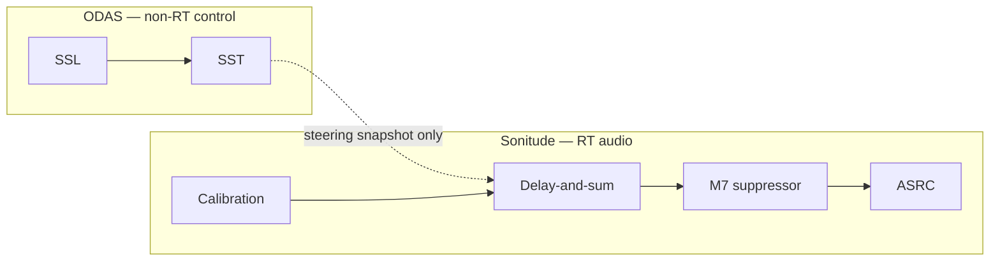
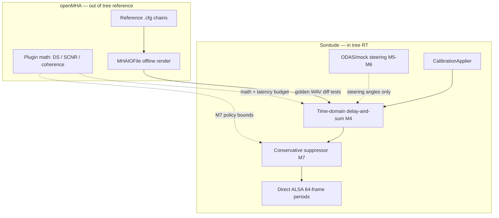

# Sonitude Architecture

This document defines the target architecture, real-time latency budget, ODAS integration posture, and ownership constraints. `docs/milestones.md` remains authoritative for gate evidence; `docs/CodebaseState.md` for scope vetoes and interface snapshots.

Last updated: 2026-08-29.

---

## Real-time latency budget

Sonitude is a **hearable-class** low-latency pipeline, not a robot-audition batch stack.


| Requirement                 | Source                                             | Value                                                                    |
| --------------------------- | -------------------------------------------------- | ------------------------------------------------------------------------ |
| Engineering one-way target  | `[latency_measurement.md](latency_measurement.md)` | **6–10 ms** (subject to hardware measurement in M8)                      |
| Latency claims              | SCOPE-4                                            | **Forbidden** until M8 impulse/loopback evidence                         |
| Capture period (default)    | `config/default.yaml`                              | 64 frames @ 44.1 kHz ≈ **1.45 ms** per ALSA period                       |
| Audio-path algorithm budget | Design intent                                      | **≪ one period** for beamformer + limiter; suppression must stay bounded |
| Control-path steering       | `steering_ramp_ms` default                         | **150 ms** crossfade (intentional audibility, not ODAS frame rate)       |


**Implication:** Any separation or post-filtering block that needs **STFT frames of 8–16 ms+**, or outputs on **128-sample hops @ 16 kHz**, is incompatible with the audio-path target unless it runs **off the RT thread** and only influences slow steering — not live PCM.

The PySide6 algorithm test bench (`testbench/`) is explicitly **outside** this budget. It drives `sonitude_wav_replay` / `sonitude_stream_process` over subprocess IPC for correctness checks, including hour-scale file streaming and live steering while playing a recording. See `testbench/README.md`. Do not treat its block-round-trip latency as an M8 measurement.

---


## Target pipeline layers

```text
Pico USB ALSA capture (6 active channels)
  -> capture timestamp / sequence accounting
  -> channel calibration (polarity, gain, delay, DC blocker)
  -> fan out to:
     A) real-time audio path
     B) non-critical spatial control path
```

Audio path target order:

```text
steering snapshot -> delay-and-sum beamformer -> conservative suppression policy
-> binaural renderer -> linked stereo limiter -> ASRC/drift control -> ALSA playback
```

Direction convention (authoritative for steering and binaural rendering;
helpers in `src/spatial/head_frame.hpp`):

```text
azimuth 0 deg  = front (+Y)
azimuth +deg   = clockwise toward listener-right (+X)
elevation +deg = up (+Z)
wrap range     = (-180, +180]
```

Control path target order:

```text
ODAS/mock DOA -> source association -> source confidence and zone selection
-> conversation state machine -> steering update -> atomic handoff
```

---


## Thread model (target)

Current M2 runtime uses one blocking capture/DSP/playback audio loop; the three RT-worker split and per-thread scheduling isolation below remain pending hardening gates. Control and telemetry already run on separate threads.

- **Capture worker thread (RT):** ALSA capture, sequence accounting, ring publication.
- **Audio render thread (RT):** beamforming, suppression policy, binaural rendering (when wired), limiting, ASRC feed.
- **Playback worker thread (RT):** ALSA playback, underrun recovery telemetry.
- **Control thread (non-RT):** ODAS client, source association, state machine.
- **Telemetry thread (non-RT):** aggregate counters, structured output, diagnostics.

---


## Data ownership rules

- Real-time threads are allocation-free after startup.
- No mutex acquisition on real-time threads.
- No file/network I/O, console output, or blocking IPC waits on real-time threads.
- Control-to-audio handoff uses atomics or immutable double-buffer snapshots.
- Ring buffers are SPSC lock-free for producer/consumer pairs.

---


## Failure behavior (target)

- ODAS/control failure must not interrupt audio.
- On control confidence loss, steering ramps to safe forward/ambient mode.
- ASRC drift controller must prevent long-run playback buffer runaway between independent capture/playback clocks.

---


## ODAS integration posture


### What ODAS provides

[ODAS](https://github.com/introlab/odas) (Open embeddeD Audition System) is a **full robot-audition stack**, not a DOA-only library:


| Stage          | Module                                                   | Output                         |
| -------------- | -------------------------------------------------------- | ------------------------------ |
| Localization   | SSL (SRP-PHAT, coarse/fine sphere search)                | Potential source directions    |
| Tracking       | SST (Kalman or particle filters)                         | Tracked source metadata (JSON) |
| Separation     | SSS — DDS delay-and-sum or DGSS geometric demixing       | **Per-source PCM streams**     |
| Post-filtering | SS (spectral subtraction) or MS (masking) in STFT domain | **Post-filtered PCM streams**  |


Sonitude v1 uses **SSL/SST metadata only** unless SCOPE-2 is vetoed. PCM beamforming and suppression stay in Sonitude (**SCOPE-2**, **SCOPE-3**).

### ODAS latency model

ODAS publishes **no single official end-to-end latency number**. Latency is dominated by **STFT framing** configured in `.cfg` files ([Configuration wiki](https://github.com/introlab/odas/wiki/Configuration)).

**Key parameters (typical defaults):**


| Parameter                            | Typical value         | Meaning                                                   |
| ------------------------------------ | --------------------- | --------------------------------------------------------- |
| `raw.hopSize`                        | 512 @ 48 kHz (varies) | Samples read from sound interface per tick                |
| `general.size.hopSize`               | **128**               | Internal processing hop                                   |
| `general.size.frameSize`             | **256**               | STFT analysis window                                      |
| `samplerate.mu`                      | **16000**             | Internal processing rate (often downsampled from capture) |
| `sss.separated/postfiltered.hopSize` | **128** @ 16 kHz      | Separated-audio output chunk size                         |


**Derived frame clock (defaults):**

```text
128 / 16000 Hz = 8 ms per processing frame
256 / 16000 Hz = 16 ms STFT analysis window
```

Frames overlap (hop 128, frame 256 = 50% overlap). All modules (noise estimation, SSL, SST, SSS, post-filter) run on this frame clock.

**Estimated latency by path:**


| Path                                                          | Order-of-magnitude estimate                                             | Notes                                                                                      |
| ------------------------------------------------------------- | ----------------------------------------------------------------------- | ------------------------------------------------------------------------------------------ |
| **Full ODAS audio** (mic → separated → post-filtered → out)   | **~50–150 ms** all-in                                                   | Algorithmic ~20–80 ms + sound-card buffering + resampling + I/O                            |
| **ODAS algorithmic minimum** (128/256 @ 16 kHz, no soundcard) | **~20–80 ms**                                                           | Post-filter MS/SS adds temporal smoothing (`winSizeGlobal = 23`, etc.)                     |
| **Control metadata only** (SSL/SST JSON, no ODAS audio tap)   | **~8 ms** frame cadence; **~20–100 ms+** useful steering responsiveness | Kalman smoothing + source hysteresis (`N_inactive` up to 250 frames ≈ 2 s to drop a track) |


**Why this excludes ODAS from the Sonitude audio path:**

- Default ODAS separation/post-filtering is **8 ms/frame STFT-class**, not period-scale time-domain processing.
- Post-filtering is **spectral** and tuned for SNR/intelligibility on robots, not sub-10 ms ear monitoring.
- Routing playback through ODAS ties listening uptime to ODAS process health (**SCOPE-2** guardrail).

**Sonitude + ODAS control-only:** expect ODAS DOA refresh at ~8 ms/frame defaults, plus Sonitude's own `steering_ramp_ms` (150 ms) and state-machine hysteresis on top.

---


## Alternatives to the ODAS full audio stack

Survey of open-source and research options for **separation** and **post-filtering** that could replace or complement ODAS SSS/post-filter stages, evaluated against Sonitude RT requirements (**6–10 ms** one-way target, direct ALSA, SCOPE-1/2/3).

**Legend — Sonitude fit:**

- **Audio RT** — suitable for live PCM on the RT audio thread at hearable latency
- **Control** — suitable for non-RT steering / DOA only (Sonitude v1 ODAS role)
- **Reference** — algorithm ideas or offline validation only
- **Out of scope** — blocked by SCOPE-1/3 or wrong platform without explicit veto


### Full stacks (localization → tracking → separation → post-filter)


| Project      | Link                                                      | Typical latency                                         | Sonitude fit                   | Notes                                                 |
| ------------ | --------------------------------------------------------- | ------------------------------------------------------- | ------------------------------ | ----------------------------------------------------- |
| **ODAS**     | [introlab/odas](https://github.com/introlab/odas)         | Full audio **~50–150 ms**; control **~8 ms/frame**      | **Control** ✓ · **Audio RT** ✗ | Default v1 choice for SST JSON only                   |
| **ManyEars** | [introlab/manyears](https://github.com/introlab/manyears) | Similar STFT robot-audition era; **not hearable-class** | **Control** ~ · **Audio RT** ✗ | ODAS predecessor; GSS + particle tracking             |
| **HARK**     | [hark.jp](https://hark.jp/)                               | Multi-machine robot audition common; **high**           | **Audio RT** ✗                 | MUSIC + GHDSS separation; heavy vs Pi hearable target |


### Hearing-aid / multichannel platforms (separation + NR plugins)


| Project                  | Link                                                                        | Reported latency                                                                                                                                                                | Sonitude fit               | Notes                                                                                                                         |
| ------------------------ | --------------------------------------------------------------------------- | ------------------------------------------------------------------------------------------------------------------------------------------------------------------------------- | -------------------------- | ----------------------------------------------------------------------------------------------------------------------------- |
| **openMHA**              | [HoerTech-gGmbH/openMHA](https://github.com/HoerTech-gGmbH/openMHA)         | **<10 ms** full chain on desktop; STFT path **~5.2 ms** algorithmic ([portable platform paper](https://pdfs.semanticscholar.org/8f59/d2617ecfecf40056613f5d6cd740d386a959.pdf)) | **Out of scope** (SCOPE-1) | Real-time path uses **JACK**, not direct ALSA; **algorithm reference + offline golden renders** — see [§openMHA platform overview](#openmha-platform-overview) |
| **vicPURE** (commercial) | [voice interconnect PDF](https://www.voiceinterconnect.de/en/vicPURE_voice) | **6 ms** (Cortex-M4F, 3-mic)                                                                                                                                                    | **Reference**              | Not open source; shows embedded beamforming + NR is feasible at target latency on dedicated DSP                               |


### Time-domain beamforming (Sonitude v1 primary audio path)


| Approach                       | Link                                                                                                  | Latency                                                  | Sonitude fit               | Notes                                                                          |
| ------------------------------ | ----------------------------------------------------------------------------------------------------- | -------------------------------------------------------- | -------------------------- | ------------------------------------------------------------------------------ |
| **In-tree delay-and-sum (M4)** | `src/dsp/beamformer.`* on integration branch                                                          | **Period-scale** (~1.5 ms blocks @ 44.1 kHz / 64 frames) | **Audio RT** ✓             | Fractional-delay FIR + steering crossfade; v1 baseline (**SCOPE-3** compliant) |
| **Custom MVDR on Pi**          | [rolyantrauts/mvdr](https://github.com/rolyantrauts/mvdr)                                             | Not published; FFTW + GCC-PHAT steering                  | **Out of scope** (SCOPE-3) | Useful RT architecture reference (NEON, ALSA pipe); 2-mic ReSpeaker focused    |
| **XMOS lib_mic_array**         | [XMOS mic array docs](https://www.xmos.com/documentation/XM-010267-UG/html/doc/rst/src/overview.html) | Frame size **configurable down to 1 sample**             | **Wrong hardware**         | PDM→PCM + beamforming on xcore.ai; not Pi/UAC path                             |
| **pyroomacoustics**            | [LCAV/pyroomacoustics](https://github.com/LCAV/pyroomacoustics)                                       | Offline / simulation                                     | **Reference**              | DS, MVDR, SRP-PHAT for algorithm validation                                    |


### Neural / adaptive separation and post-filtering


| Project             | Link                                                                                                | Reported latency                                                                                                                                          | Sonitude fit               | Notes                                                                                                          |
| ------------------- | --------------------------------------------------------------------------------------------------- | --------------------------------------------------------------------------------------------------------------------------------------------------------- | -------------------------- | -------------------------------------------------------------------------------------------------------------- |
| **FaSNet / TAC**    | [yluo42/TAC](https://github.com/yluo42/TAC), [FaSNet paper](https://arxiv.org/abs/1909.13387)       | Time-domain, **low-latency by design**; frame filters + DPRNN segments                                                                                    | **Out of scope** (SCOPE-3) | PyTorch research code; adaptive filter-and-sum; post-v1 if vetoed                                              |
| **DFSNet**          | [INTERSPEECH 2023 paper](https://www.isca-archive.org/interspeech_2023/kovalyov23_interspeech.html) | Causal steerable neural beamformer; **hearing-aid oriented**                                                                                              | **Out of scope** (SCOPE-3) | Delay-then-filter-and-sum; no maintained Pi RT port found                                                      |
| **DeepFilterNet3**  | [Rikorose/DeepFilterNet](https://github.com/Rikorose/DeepFilterNet)                                 | **~40 ms** default (20 ms window, 10 ms hop, 2-frame lookahead); **~10 ms** LL variants ([deepfilter-rt](https://github.com/shimondoodkin/deepfilter-rt)) | **Out of scope** (SCOPE-3) | Single-channel post-filter **after** beamform conceivable; still above 6–10 ms target at 48 kHz                |
| **Deep FIR / LSTW** | [Google Deep FIR](https://google-research.github.io/sound-separation/papers/deepfir/)               | **0.3–3.4 ms** algorithmic on DSP                                                                                                                         | **Out of scope** (SCOPE-3) | Sub-ms class; single-channel enhancement; research/demo                                                        |
| **RNNoise**         | [xiph/rnnoise](https://github.com/xiph/rnnoise)                                                     | **10 ms** frames @ 48 kHz                                                                                                                                 | **Out of scope** (SCOPE-3) | Lightweight single-channel suppressor; used in [noisegate](https://github.com/Yashsomalkar/noisegate) RT paths |


### Curated indexes


| Resource              | Link                                                                        | Use for Sonitude                                |
| --------------------- | --------------------------------------------------------------------------- | ----------------------------------------------- |
| **beamforming-tools** | [eac-ufsm/beamforming-tools](https://github.com/eac-ufsm/beamforming-tools) | Curated list of DS/MVDR/ODAS/openMHA/HARK links |


---


## Architectural decision summary




| Function              | v1 owner          | Rationale                                                                          |
| --------------------- | ----------------- | ---------------------------------------------------------------------------------- |
| DOA / source tracking | ODAS or mock (M5) | Mature SSL/SST; 8 ms/frame metadata acceptable on control thread                   |
| Beamforming (PCM)     | Sonitude M4       | Period-scale time-domain; meets 6–10 ms budget                                     |
| Suppression (PCM)     | Sonitude M7       | One conservative policy; bounded latency; no ODAS STFT post-filter                 |
| Post-filter / NR      | Not ODAS in v1    | ODAS SS/MS is 20–80 ms+ class; DeepFilterNet etc. blocked by SCOPE-3 unless vetoed |


**If SCOPE-2 is vetoed** (ODAS processes audio): Sonitude becomes capture/playback shell; expect **~50–150 ms** listening latency and ODAS uptime dependency — incompatible with current M8 target without revising requirements.

**If SCOPE-3 is vetoed** (neural/MVDR allowed): FaSNet, DeepFilterNet-LL, or openMHA plugin math become candidates for **post-beamform** stages on a **non-RT worker** with async ring delivery — still requires M8 measurement before latency claims.

---


## openMHA platform overview

[openMHA](https://github.com/HoerTech-gGmbH/openMHA) (open Master Hearing Aid) is an open-source, real-time hearing-aid research platform maintained by HörTech gGmbH and Universität Oldenburg [1]. It evolved from the commercial Master Hearing Aid (MHA) toolchain [3] and targets the same constraints as consumer hearables: **causal processing**, **allocation-free audio threads**, and **end-to-end acoustic latency typically held below 10 ms** — the upper bound commonly cited for natural own-voice perception and audio–visual synchrony [1].

### Architecture (plugin host model)

openMHA is a headless C++17 host (`mha`) that loads:

| Component | Role |
| --------- | ---- |
| **IO plugin** (one) | Connects to JACK, files, or TCP streams; sets block size and channel layout |
| **Processing plugin** (one root) | Implements the hearing-aid chain; may nest further plugins via bridge loaders |
| **libopenmha toolbox** | Shared filters, STFT bridge (`overlapadd`), RT-safe config double-buffering, plugin base classes |
| **TCP config port** | Matlab/Octave/Python/Node-RED control without stopping audio |

Signal and configuration flow matches the published framework diagram: audio travels plugin-to-plugin; configuration commands are parsed on a non-RT thread and applied via prepared runtime snapshots so the processing thread never blocks on parameter recalculation [1], [2].

```text
Sound source/sink (JACK | file | TCP)
  -> IO plugin (MHAIOJack | MHAIOFile | …)
  -> transducers (mic/RCV calibration to Pascal convention)
  -> mhachain of algorithm plugins (time-domain and/or STFT-domain)
  -> transducers (output calibration)
  -> IO plugin
```

Bridge plugins (`overlapadd`, `transducers`, `mhachain`) are central: `overlapadd` performs shared STFT analysis/synthesis so downstream spectral plugins (coherence filter, SCNR, MVDR) do not each pay a separate transform delay [2].

### Latency model (published)

Latency in openMHA is **microphone acoustic input → receiver acoustic output**, including:

1. **Algorithmic delay** — filter group delay, STFT window/hop (shared `overlapadd` amortizes this across plugins).
2. **Block buffering** — typically 64 samples at 44.1 kHz in reference configs [2].
3. **Sound-card / server buffering** — JACK period stacking on top of ALSA (desktop) or Mahalia-tuned ALSA (Portable Hearing Laboratory, PHL).

Published reference numbers:


| Configuration | Rate | Block | Algorithmic | I/O stack | Total (reported) | Source |
| ------------- | ---- | ----- | ----------- | --------- | ---------------- | ------ |
| ADM + coherence + 5-band DC | 44.1 kHz | 64 | **4.4 ms** | **+4.4 ms** (JACK/RME) | **8.8 ms** | [2] |
| PHL generic hearing aid (ADM + coherence + DC + freq. shifter) | 24 kHz | — | (in STFT chain) | Mahalia/Cape4all | **10 ms** | [1] |
| DNN speech enhancement (4-mic BTE) | — | — | **5.4 ms** | separate from PHL CPU | algorithmic only | openMHA 4.18 release notes |

The SoftwareX paper notes that **10 ms** is the practical ceiling for hearing-aid listening comfort [1]. Sonitude's **6–10 ms engineering target** is therefore aligned with openMHA's design centre, but Sonitude pursues it via **direct ALSA period processing** rather than JACK server stacking (**SCOPE-1**).

### Algorithm inventory relevant to Sonitude

openMHA ships reference implementations (with reproducible `.cfg` chains in `reference_algorithms/`) for:


| openMHA plugin / chain | Function | Sonitude relevance |
| ---------------------- | -------- | ------------------ |
| **delay-and-sum beamformer** | Far-field steering, multichannel → mono | **Primary M4 reference** for steering geometry and weights |
| **MVDR / binaural steering beamformer** [6] | Adaptive spatial filter, moving source | Post-v1 if **SCOPE-3** vetoed |
| **ADM** (adaptive differential microphone) [7] | Two-mic rear-hemisphere rejection | Geometry mismatch (6-mic head array); ideas only |
| **Binaural coherence filter** [4] | STFT gain from interaural coherence | M7 suppression **reference**; STFT latency too high for v1 RT path |
| **SCNR** (single-channel NR) [5] | MMSE noise power estimation, spectral suppression | M7 **offline validation** reference; RT port needs minimal-hop variant |
| **Probabilistic SSL** [8] | Acoustic source localization | Control-path alternative to ODAS; not v1 |
| **transducers** | Mic/RCV calibration to Pascal | Calibration **methodology** reference; Sonitude uses linear float without SPL mapping in v1 |

---


## Sonitude adaptation of openMHA (design)

Sonitude does **not** embed the openMHA runtime. **SCOPE-1** forbids JACK (openMHA's default live IO path), and **SCOPE-3** limits v1 to delay-and-sum plus one conservative suppressor. The adaptation is therefore a **documented port of algorithms, RT patterns, and validation methodology** — not a plugin-host integration.



### Adaptation principles

1. **Same problem class, different IO contract.** openMHA targets hearing-aid research with JACK or file IO and Pascal-level calibration [1], [2]. Sonitude targets a **Pi 5 + Pico UAC + USB DAC** path with **float `MicFrame` blocks**, YAML calibration, and **ODAS steering** instead of openMHA's in-chain SSL [8].
2. **Time-domain first on the RT thread.** openMHA's flagship chains lean on shared STFT (`overlapadd`) for coherence filtering, SCNR, and MVDR [2], [4], [5]. Sonitude v1 keeps beamforming in the **time domain at capture period scale** (~1.45 ms @ 44.1 kHz / 64 frames) to preserve the audio-path budget in §Real-time latency budget.
3. **RT-safe handoff mirrors openMHA config double-buffering.** openMHA prepares updated runtime configs on a configuration thread and swaps atomically into the processing thread [2]. Sonitude maps this to **immutable steering snapshots** published by the control thread and read lock-free on the audio render thread (already in §Thread model).
4. **openMHA is the golden reference, not the shipping stack.** Offline file chains (`MHAIOFile`) render reference PCM for `sonitude_wav_replay` diff tests without pulling JACK or TCP control into CI.

### Block-level mapping (v1)


| Sonitude block | Milestone | openMHA reference | Adaptation |
| -------------- | --------- | ----------------- | ---------- |
| **CalibrationApplier** | M3 | `transducers` plugin [1] | Port **ordering** (polarity → gain → high-pass), not Pascal SPL mapping; per-mic delays deferred to beamformer |
| **Delay-and-sum beamformer** | M4 | `delay_and_sum` / reference DS configs | Reimplement in-tree: fractional-delay FIR + dual-beam crossfade; match steering vector and 1/N weights against openMHA offline render |
| **Steering control** | M5–M6 | MVDR steering updates [6] (not v1) | ODAS/mock publishes azimuth/elevation only; no openMHA TCP steering |
| **Suppression policy** | M7 | SCNR [5], binaural coherence [4] | **Policy bounds** from openMHA (max attenuation, ambient floor); v1 implements a **single conservative time-domain or minimal-latency** rule — not full STFT coherence chain |
| **Limiter / ASRC** | M2 | `limiter`, `resample` plugins | Independent Sonitude implementations; compare saturation behaviour offline only |

### M4 beamformer — openMHA-aligned design

The in-tree `IBeamformer` (M4) follows the openMHA delay-and-sum convention:

1. **Far-field plane-wave delays** from mic positions (YAML geometry) and steering direction **u**, using the same speed-of-sound parameter as config (`343 m/s` default).
2. **Per-channel fractional delay** — 8-tap windowed-sinc FIR (Sonitude choice for Pi NEON); openMHA uses equivalent delay lines in the DS plugin.
3. **Equal-weight sum** `1/6` → mono (`MicFrame` → scalar).
4. **Click-free steering** — dual-beam crossfade over `steering_ramp_ms` (150 ms default). openMHA MVDR chains use related steering smoothing for moving sources [6]; Sonitude applies the same *intent* at the control–audio boundary without adaptive covariance estimation (**SCOPE-3**).

**Validation gate (M4):** render identical 6-ch fixture WAV through (a) openMHA `MHAIOFile` + reference DS `.cfg` and (b) `sonitude_wav_replay`; assert RMS/phase match within tolerance at fixed steering angles. Evidence field in `docs/milestones.md`.

### M7 suppression — openMHA-informed conservative policy

openMHA's coherence filter [4] and SCNR [5] demonstrate that **spectral, multi-frame** enhancement is acceptable in hearing-aid research when total latency stays under ~10 ms with shared STFT. Sonitude's stricter **6–10 ms one-way** target and **64-sample periods** rule out a full `overlapadd` → coherence → `overlapadd` chain on the RT thread without M8 remeasurement.

v1 M7 adaptation:

| Aspect | openMHA reference | Sonitude v1 choice |
| ------ | ----------------- | ------------------ |
| Noise estimation | MMSE noise power tracker [5] | Simpler envelope follower or gated attenuation after beamform |
| Spatial cue | Binaural coherence gains [4] | Already consumed by **beamformer steering**; no second spatial stage |
| Max attenuation | Plugin-configured caps in `.cfg` | Config `ambient_floor_linear` (0.25 default) — never fully mute |
| User selection | TCP/Matlab GUIs [1] | Explicit suppressor enable + zone selection (M6 state machine) |
| Validation | Reference SCNR `.cfg` on same fixture | Offline SNR comparison; **no latency claim** until M8 |

If **SCOPE-3** is vetoed later, openMHA's **MVDR** [6] or **ADM** [7] chains become candidates for a **non-RT worker** feeding an async ring into the limiter — preserving SCOPE-1 (no JACK) by porting plugin math, not hosting `mha`.

### Control path — deliberate non-adaptation

openMHA includes probabilistic SSL [8] suitable for steering spatial filters inside the host. Sonitude v1 keeps **ODAS SSL/SST** (or mock) on the control thread because:

- ODAS tracking JSON is already integrated in the milestone plan (M5–M6).
- Running openMHA SSL would require either JACK fan-out or a second process consuming multichannel PCM — conflicting with **SCOPE-2** (ODAS control-only) and complicating RT ownership.

openMHA SSL remains a **documented fallback** if ODAS is retired post-v1.

### Latency budget comparison


| Stage | openMHA typical (44.1 kHz, 64-block, STFT chain) | Sonitude v1 target |
| ----- | ------------------------------------------------ | ------------------ |
| Capture buffer | 1 × JACK period (~1.5 ms) + ALSA | 1 × ALSA period (~1.45 ms) |
| Beamforming | ADM or DS (time) + optional STFT plugins | Time-domain DS only (~FIR group delay ≪ 1 period) |
| Suppression | STFT SCNR/coherence (+4–8 ms algorithmic) | Bounded time-domain policy (≪ 1 period) |
| Playback buffer | 1–2 × JACK periods | 1 × ALSA period + ASRC PI buffer |
| **Total (engineering)** | **~8–10 ms** published [1], [2] | **6–10 ms** (M8 measured) |

---


## openMHA reference validation workflow (offline)

Out-of-tree procedure for milestone evidence — not part of the Pi runtime image:

1. Install openMHA on a Linux host (same tag recorded in test log).
2. Convert Sonitude 6-ch fixture to openMHA channel layout; set `transducers` gains from `calibration_example.yaml` (linear domain, not Pascal, for v1 parity).
3. Run reference configs:
   - **M4:** delay-and-sum beamformer configuration matching fixture geometry.
   - **M7 (optional):** SCNR or coherence reference chain on **beamformed mono** exported from step 3.
4. Compare openMHA `MHAIOFile` output against `sonitude_wav_replay` / unit tests (RMS, max sample delta, optional STFT diff).
5. Record openMHA version, `.cfg` paths, and diff metrics in milestone gate evidence.

This satisfies reproducibility goals of the openMHA platform [1] while keeping openMHA out of the Sonitude build graph.

---


## openMHA-related scope interactions


| Guardrail | Effect on openMHA adaptation |
| --------- | ---------------------------- |
| **SCOPE-1** (no JACK) | Blocks hosting `mha` with `MHAIOJack` in the live path; offline `MHAIOFile` only |
| **SCOPE-2** (ODAS control-only) | No openMHA+ODAS hybrid audio chain |
| **SCOPE-3** (no MVDR/neural) | DS + conservative suppressor only; MVDR/ADM/DNN openMHA configs are reference-only |
| **SCOPE-7** (reference-only firmware vendoring) | openMHA remains out-of-tree and out of the Sonitude build graph (`libopenmha` not linked) |

**If SCOPE-1 is vetoed:** a sidecar `mha` on JACK could process a tap — still incompatible with direct `hw:` latency claims unless remeasured (M8).

**If SCOPE-3 is vetoed:** prioritize openMHA **MVDR** [6] or **SCNR** [5] math on a **non-RT worker** before neural stacks; openMHA 4.18 DNN examples (5.4 ms algorithmic) remain post-v1 benchmarks.

---


## References (IEEE style)

[1] H. Kayser, T. Herzke, P. Maanen, M. Zimmermann, G. Grimm, and V. Hohmann, "Open community platform for hearing aid algorithm research: open Master Hearing Aid (openMHA)," *SoftwareX*, vol. 17, p. 100953, 2022, doi: [10.1016/j.softx.2021.100953](https://doi.org/10.1016/j.softx.2021.100953).

[2] T. Herzke, H. Kayser, F. Loshaj, G. Grimm, and V. Hohmann, "Open signal processing software platform for hearing aid research (openMHA)," in *Proc. Linux Audio Conf.*, Saint-Étienne, France, 2017, pp. 35–42.

[3] G. Grimm, T. Herzke, D. Berg, and V. Hohmann, "The master hearing aid: a PC-based platform for algorithm development and evaluation," *Acta Acust. united Acust.*, vol. 92, no. 4, pp. 618–628, 2006.

[4] G. Grimm, V. Hohmann, and B. Kollmeier, "Increase and subjective evaluation of feedback stability in hearing aids by a binaural coherence-based noise reduction scheme," *IEEE/ACM Trans. Audio, Speech, Language Process.*, vol. 17, no. 7, pp. 1408–1419, Jul. 2009, doi: [10.1109/TASL.2009.2017436](https://doi.org/10.1109/TASL.2009.2017436).

[5] T. Gerkmann and R. C. Hendriks, "Unbiased MMSE-based noise power estimation with low complexity and low tracking delay," *IEEE/ACM Trans. Audio, Speech, Language Process.*, vol. 20, no. 4, pp. 1383–1393, May 2012, doi: [10.1109/TASL.2011.2180904](https://doi.org/10.1109/TASL.2011.2180904).

[6] K. Adiloğlu, H. Kayser, R. M. Baumgärtel, S. Rennebeck, M. Dietz, and V. Hohmann, "A binaural steering beamformer system for enhancing a moving speech source," *Trends Hear.*, vol. 19, 2015, doi: [10.1177/2331216515618903](https://doi.org/10.1177/2331216515618903).

[7] G. W. Elko and A.-T. N. Pong, "A simple adaptive first-order differential microphone," in *Proc. IEEE Workshop Appl. Signal Process. Audio Acoust.*, New Paltz, NY, USA, 1995, pp. 169–172.

[8] H. Kayser and J. Anemüller, "A discriminative learning approach to probabilistic acoustic source localization," in *Proc. Int. Workshop Acoustic Echo Noise Control (IWAENC)*, Antibes, France, 2014, pp. 100–104.

---


## Current implementation status


| Area                                     | Status                                                                |
| ---------------------------------------- | --------------------------------------------------------------------- |
| ALSA capture/playback, passthrough, ASRC | Implemented (M1–M2, gates pending Pi soak)                           |
| Calibration load/apply/tools             | Implemented (M3, HW sweep pending)                                   |
| Beamformer, ODAS adapter, state machine  | Implemented in code; milestone-gate evidence still pending (M4–M6)   |
| Suppression, limiter                     | Implemented in beamform path; milestone-gate evidence pending (M7)   |
| Latency instrumentation                  | Pending hardware measurement and reporting (M8)                       |
| ODAS latency / alternative survey        | Documented here; **not measured on project hardware**                 |
| openMHA adaptation (reference + offline) | Documented here ([§Sonitude adaptation](#sonitude-adaptation-of-openmha-design)); not integrated in runtime |


---


## Related documents

- Latency measurement method and acceptance target: `[latency_measurement.md](latency_measurement.md)`
- Scope guardrails (SCOPE-1–7): `CodebaseState.md` [§1](CodebaseState.md#1-global-project-scope)
- Milestone gates: `[milestones.md](milestones.md)`

